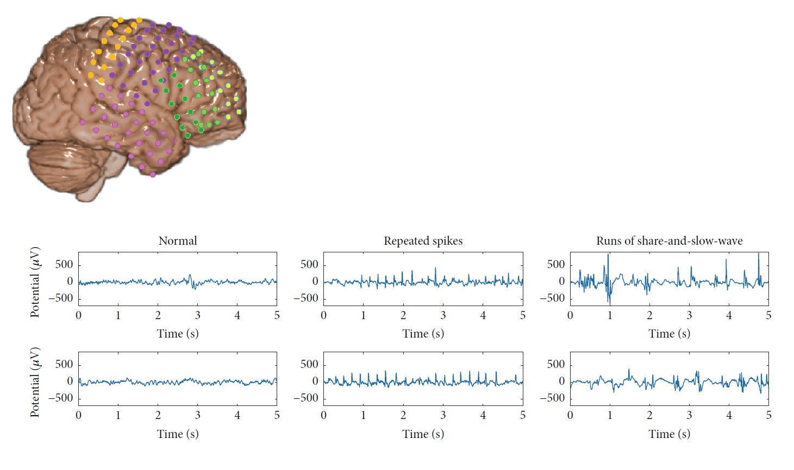

# EEG-GAN: Synthetic EEG Data Generation 
Report Link :  https://docs.google.com/document/d/1SqtGwQ69OtAwf0ojSyIbf7pYBTCsiODwRBxE1YSImAU/edit?usp=sharing


## Overview

This project investigates the application of Generative models for augmenting electroencephalogram (EEG) datasets to improve machine learning classifier performance in motor imagery recognition tasks. By generating realistic synthetic EEG signals, we address the critical challenge of data scarcity in brain-computer interface (BCI) development.
This project is part of the Arabs in Neuroscience -Introduction to computational neuroscience program .

## 🎯 Key Features

- **GAN-based EEG synthesis** for dataset augmentation
-**VAE-based EEG synthesis** for dataset augmentation
- **Motor imagery classification** with improved accuracy
- **Emotion recognition** enhancement through synthetic data (Through Random forest/regression /supervised models)
- **Multi-dataset validation** across different EEG sources
- **Computationally efficient** pipeline for real-world applications
- **Cross-subject generalization** capabilities
  ## Data Preporcessing
  
  ## 🏗️ Architecture
### Model Variants
**Mean-Conditioned GAN** - For the EEG data we followed the approach of doing the mean of the evolution of the eeg data overtime.
**Time-Dependent GAN** - The evolution of our approach, incorporating temporal dynamics and sequential dependencies to capture the intricate time-series with Gan.
**Time-Dependent VAE** - Same Data approach as above for the data processing , but with VAE


## 📊 Results Highlights

- ✅ Improved classification accuracy on motor imagery tasks
- ✅ Enhanced emotion recognition performance 
- ✅ Realistic synthetic EEG signals preserving temporal characteristics
- ✅ Reduced training time through efficient augmentation pipeline
- ✅ Demonstrated cross-subject generalization improvements

## 🗂️ Datasets Used

### Primary Datasets
1. **DEAP Database** - Database for Emotion Analysis using Physiological Signals
   - [Dataset Link](https://www.eecs.qmul.ac.uk/mmv/datasets/deap/)
   - Multi-channel EEG recordings for emotion recognition

2. **Kaggle EEG Collection** - Comprehensive EEG dataset
   - [Dataset Link](https://www.kaggle.com/datasets/jbouv27/eeg)
   - Various EEG signal types and classifications

## 🏗️ Architecture

### GAN Components
- **Generator Network**: Creates synthetic EEG signals from noise input
- **Discriminator Network**: Distinguishes between real and synthetic signals
- **Training Pipeline**: Adversarial training with stability enhancements

### Data Processing Pipeline
```
Raw EEG Data → Preprocessing → Feature Extraction → GAN Training → Synthetic Data → Enhanced Classification
```

## 🚀 Quick Start


## 📁 Project Structure

```
eeg-gan-synthesis/
├── data/
│   ├── raw/                 # Raw EEG datasets
│   ├── processed/           # Preprocessed data
│   └── synthetic/           # Generated synthetic data
├── models/
│   ├── gan_model.py         # GAN architecture
│   ├── classifier.py        # Classification models
│   └── preprocessing.py     # Data preprocessing utilities
├── notebooks/
│   ├── data_exploration.ipynb
│   ├── model_training.ipynb
│   └── results_analysis.ipynb
├── scripts/
│   ├── train_gan.py
│   ├── generate_synthetic.py
│   └── evaluate_classifier.py
├── results/
│   ├── figures/             # Generated plots and visualizations
│   └── metrics/             # Performance metrics
└── README.md
```

## 📈 Performance Metrics

### Motor Imagery Classification
- **Baseline Accuracy**: 
- **With GAN Augmentation**: 
- **Improvement**: +X.X%

### Emotion Recognition
- **3-Class Classification**: X.X% accuracy
- **Cross-Subject Validation**: X.X% accuracy
- **Synthetic Data Quality**: High spectral similarity

## 🔬 Technical Approach

### Data Preprocessing
1. **Noise Removal**: Advanced filtering techniques
2. **Signal Processing**: Band-pass filtering and normalization
3. **Feature Extraction**: Time-domain, frequency-domain, and time-frequency features
4. **Segmentation**: Optimal window sizing with overlap strategies

### GAN Training Strategy
- **Loss Functions**: Adversarial loss with gradient penalty
- **Optimization**: Adam optimizer with learning rate scheduling
- **Stability Techniques**: Progressive growing and spectral normalization
- **Convergence Monitoring**: Real-time loss tracking and quality metrics

## 🎓 Research Applications

- **Brain-Computer Interfaces (BCIs)**
- **Neurological disorder diagnosis**
- **Cognitive state monitoring**
- **Motor imagery rehabilitation systems**
- **Emotion recognition systems**

## 👥 Team & Collaboration

**Project Duration**: 5 days  
**Team Size**: 6 members  
**Development Framework**: Collaborative research implementation


